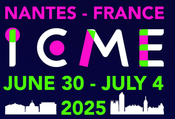

readme
<nav class="navbar navbar-expand-lg bg-secondary text-uppercase fixed-top" id="mainNav">
        

            

                <button 
                    style="background-color: #0A0E3A !important;"   
                    class="navbar-toggler navbar-toggler-right text-uppercase font-weight-bold bg-primary text-white rounded"
                    type="button" data-toggle="collapse" data-target="#navbarResponsive" aria-controls="navbarResponsive"
                    aria-expanded="false" aria-label="Toggle navigation">
                    Menu
                    <i class="fas fa-bars"></i>
                </button>
            

            

                

                    
                

                <!-- 
 -->
                
IEEE International Conference on Multimedia and Expo

            

        

        

            

                <ul class="navbar-nav ml-auto">
                    <li class="nav-item mx-0 mx-lg-1">
                        <a class="nav-link py-3 px-0 px-lg-3 rounded js-scroll-trigger" href="#SessionAbstract">Session Abstract</a>
                    </li>
                    <li class="nav-item mx-0 mx-lg-1">
                        <a class="nav-link py-3 px-0 px-lg-3 rounded js-scroll-trigger" href="#topics">Call for papers</a>
                    </li>
                    <li class="nav-item mx-0 mx-lg-1">
                        <a class="nav-link py-3 px-0 px-lg-3 rounded js-scroll-trigger" href="#paper">programme</a>
                    </li>
                    <li class="nav-item mx-0 mx-lg-1">
                        <a class="nav-link py-3 px-0 px-lg-3 rounded js-scroll-trigger" href="#Submission">Submission</a>
                    </li>
                    <!-- <li class="nav-item mx-0 mx-lg-1">
                        <a class="nav-link py-3 px-0 px-lg-3 rounded js-scroll-trigger"
                            href="#InvitedPapers">Invited Papers</a>
                    </li> -->
                    <li class="nav-item mx-0 mx-lg-1">
                        <a class="nav-link py-3 px-0 px-lg-3 rounded js-scroll-trigger"
                            href="#GeneralChairs">Organizers</a>
                    </li>
                    <!-- <li class="nav-item mx-0 mx-lg-1">
                        <a class="nav-link py-3 px-0 px-lg-3 rounded js-scroll-trigger"
                            href="#SteeringCommittee">Program Committee</a>
                    </li> -->
                    <li class="nav-item mx-0 mx-lg-1">
                        <a class="nav-link py-3 px-0 px-lg-3 rounded js-scroll-trigger"
                            href="#schedule">IMPORTANT DATES</a>
                    </li>
                    <!-- <li class="nav-item mx-0 mx-lg-1">
                        <a class="nav-link py-3 px-0 px-lg-3 rounded js-scroll-trigger"
                            href="#speakers">Keynotes</a>
                    </li> -->
                </ul>
            

        

    </nav>